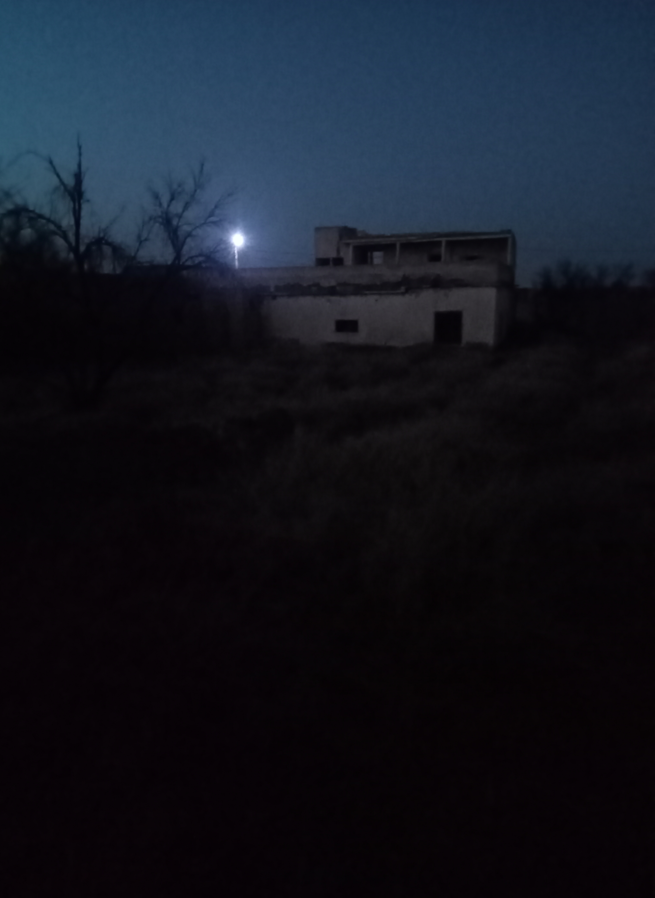

# PHI-005-PH01

### Type: Photograph Record
### Date Taken: 15 February 2024
### Source: TIPA Field Camera 1
### Evidence Status: Archived

---

## Photograph

---

## Description

Photograph depicts an abandoned rural structure during nighttime inspection.

Observed features include:

- A deteriorated building with no visible interior illumination.
- A distant external light source visible beyond the structure.
- Heavy shadowing in the foreground.
- No people present in the frame.

The image was retained because multiple witnesses identified the building as the source of the reported nighttime glow.

---

## Metadata Review

No relevant metadata recovered from the archived copy.

---

## Investigator Remarks

The photograph does not confirm the presence of any paranatural light source.

It does preserve the visual conditions under which the reports were made.
